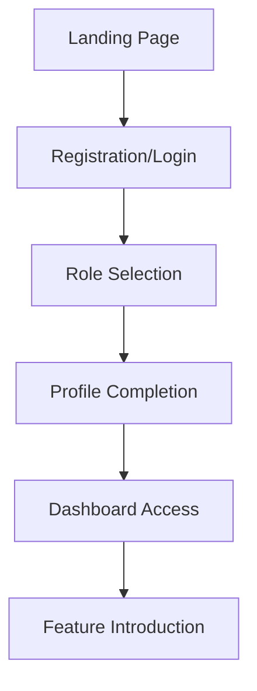
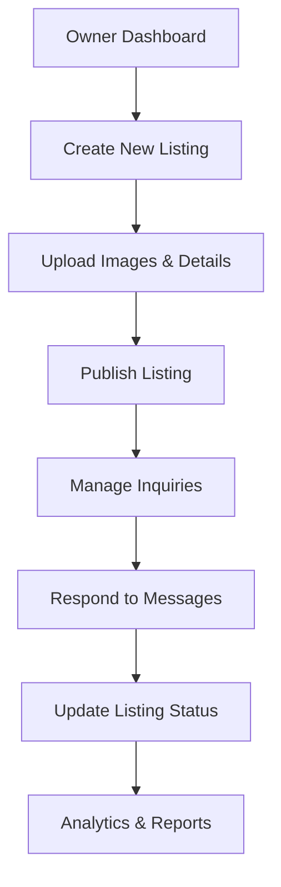
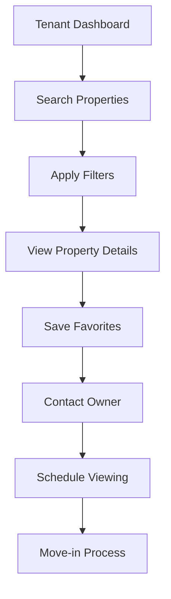
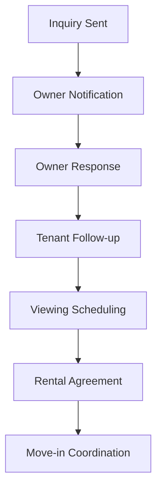

# House Hunting App - Feature & Workflow Specification

## Overview

The House Hunting App is a comprehensive platform designed to bridge the gap between property owners and prospective tenants. The application facilitates seamless property discovery, listing management, and communication between all parties involved in the rental process.

## Tech Stack

- **Frontend**: React Native with TypeScript, Expo and Expo router
- **Backend/Database**: Supabase
- **UI Framework**: React Native Paper
- **Maps & Location**: Google Maps API for property location services
- **Image Storage**: Supabase Storage for property images and media
- **Real-time Features**: Supabase Realtime for live messaging and notifications

### Key Objectives
- **For Property Owners/Agents**: Streamlined property listing management with tenant outreach capabilities
- **For Tenants/Prospective Renters**: Efficient property discovery with direct owner communication
- **For Moving Tenants**: Ability to list their current property for new tenants

---

## Core Features

### 1. User Roles & Authentication

#### User Types
- **Owner/Agent**: Property owners, real estate agents, and property managers
- **Tenant/Prospective Renter**: Individuals seeking rental properties

#### Authentication System
- **Registration Options**:
  - Email-based registration
  - Phone number verification
  - Social media integration (Google, Facebook, Apple)
- **Profile Management**:
  - Personal information (name, contact details, preferences)
  - Role selection during registration
  - Profile picture and verification status
- **Security Features**:
  - Two-factor authentication (optional)
  - Password recovery via email/SMS
  - Session management and auto-logout

### 2. Property Listing Management

#### For Property Owners/Agents

**Listing Creation**
- Comprehensive property details form:
  - Basic information (title, description, property type)
  - Location details (address, neighborhood, city, postal code)
  - Pricing information (rent amount, deposit, utilities included)
  - Property specifications (bedrooms, bathrooms, square footage)
  - Amenities and features (parking, appliances, utilities)
  - Availability dates and move-in requirements

**Media Management**
- Multiple image upload with drag-and-drop functionality
- Image optimization and compression
- Virtual tour support (360° photos, video tours)
- Image gallery with thumbnail previews
- Bulk upload capabilities

**Listing Status Control**
- Available/Unavailable toggle
- Rented status marking
- Temporary suspension options
- Automatic availability updates

**Listing Management Dashboard**
- Edit existing listings
- Duplicate listings for similar properties
- Bulk operations (delete, update status)
- Listing analytics and view statistics

#### For Tenants/Prospective Renters

**Property Discovery**
- Browse all available listings
- Advanced search with multiple filters
- Save favorite properties
- Share listings with others
- Request additional information

**Property Details View**
- Comprehensive property information
- High-resolution image galleries
- Location mapping and neighborhood information
- Contact owner directly
- Schedule viewing appointments

### 3. Advanced Search & Filtering

#### Search Capabilities
- **Location-based search**:
  - City, neighborhood, postal code
  - Map-based radius search
  - Commute time considerations

- **Property specifications**:
  - Price range (min/max)
  - Number of bedrooms and bathrooms
  - Property type (apartment, house, studio, townhouse)
  - Square footage requirements
  - Pet-friendly options

- **Additional filters**:
  - Move-in date requirements
  - Furnished/unfurnished preferences
  - Parking availability
  - Accessibility features
  - Energy efficiency ratings

#### View Options
- **List View**: Compact property cards with key information
- **Grid View**: Image-focused browsing experience
- **Map View**: Geographic property distribution
- **Saved Properties**: Personal collection management

### 4. Communication & Messaging System

#### In-App Messaging
- **Real-time chat functionality**:
  - Direct messaging between tenants and owners
  - Message history and conversation threads
  - File and image sharing capabilities
  - Read receipts and typing indicators

- **Inquiry Management**:
  - Structured inquiry forms
  - Pre-filled property information
  - Inquiry tracking and status updates
  - Response time analytics

#### Notification System
- **Push notifications** for:
  - New messages and inquiries
  - Property status changes
  - Viewing appointment confirmations
  - Price updates on saved properties

- **Email notifications** for:
  - Account verification
  - Important updates and reminders
  - Weekly property recommendations

### 5. Tenant Moving Out Feature

#### Property Listing by Tenants
- **Current tenant listing capabilities**:
  - Upload current property photos
  - Provide detailed property information
  - Set competitive rent pricing
  - Specify availability dates
  - Include current tenant testimonials

- **Listing verification process**:
  - Owner approval for tenant listings
  - Property verification requirements
  - Photo authenticity checks

#### Benefits for Moving Tenants
- **Incentive programs**:
  - Reduced listing fees
  - Priority placement in search results
  - Referral bonuses for successful rentals

### 6. Dashboard & Analytics

#### Owner Dashboard
- **Listing performance metrics**:
  - View counts and engagement statistics
  - Inquiry conversion rates
  - Response time analytics
  - Market comparison data

- **Management tools**:
  - Bulk listing operations
  - Calendar integration for viewings
  - Financial tracking and reporting

#### Tenant Dashboard
- **Personalized experience**:
  - Saved properties management
  - Search history and preferences
  - Inquiry tracking and responses
  - Recommended properties

---

## User Workflow & App Structure

### 1. User Onboarding Flow



**Registration Process**
1. **Landing Page**: App introduction and value proposition
2. **Registration**: Email/phone or social media signup
3. **Role Selection**: Choose between Owner/Agent or Tenant
4. **Profile Setup**: Complete personal information and preferences
5. **Verification**: Email/phone verification and account activation
6. **Onboarding**: Guided tour of relevant features

### 2. Owner/Agent Workflow



**Daily Operations**
1. **Dashboard Overview**: View all listings and recent activity
2. **Listing Management**: Create, edit, or update property listings
3. **Inquiry Handling**: Respond to tenant inquiries and messages
4. **Status Updates**: Mark properties as rented or adjust availability
5. **Performance Review**: Monitor listing performance and analytics

### 3. Tenant Workflow



**Property Discovery Process**
1. **Search & Browse**: Use filters to find suitable properties
2. **Property Evaluation**: Review details, images, and location
3. **Favorites Management**: Save interesting properties for later
4. **Owner Communication**: Send inquiries and schedule viewings
5. **Decision Making**: Compare properties and make rental decisions

### 4. Communication Workflow



**Message Flow**
1. **Initial Contact**: Tenant sends inquiry through structured form
2. **Owner Response**: Prompt response with additional information
3. **Follow-up Communication**: Ongoing dialogue about property details
4. **Viewing Coordination**: Schedule and confirm property viewings
5. **Rental Process**: Finalize rental agreement and move-in details

### 5. Profile Management

**User Profile Features**
- **Personal Information**: Name, contact details, preferences
- **Account Settings**: Password, notification preferences, privacy settings
- **Activity History**: Recent searches, saved properties, message history
- **Preferences**: Search filters, notification settings, communication preferences

**Security & Privacy**
- **Data Protection**: GDPR compliance and data encryption
- **Privacy Controls**: Manage information visibility and sharing
- **Account Security**: Two-factor authentication and login history

### 6. Logout & Session Management

**Session Security**
- **Automatic Logout**: Inactivity timeout and session expiration
- **Multi-device Support**: Manage active sessions across devices
- **Secure Logout**: Clear session data and authentication tokens
- **Remember Me**: Optional persistent login for trusted devices

---

## Technical Requirements

### Platform Support
- **Web Application**: Responsive design for desktop and mobile browsers
- **Mobile Applications**: Native iOS and Android apps
- **Cross-platform Compatibility**: Consistent experience across devices

### Performance Requirements
- **Fast Loading**: Optimized images and content delivery
- **Real-time Updates**: Live messaging and notification systems
- **Offline Capabilities**: Basic functionality without internet connection
- **Scalability**: Support for large numbers of users and listings

### Security Standards
- **Data Encryption**: End-to-end encryption for sensitive information
- **Secure Authentication**: OAuth 2.0 and JWT token management
- **Input Validation**: Comprehensive data validation and sanitization
- **Regular Security Audits**: Ongoing security monitoring and updates

---

## Database Schema

### Core Tables

#### 1. users
```sql
CREATE TABLE users (
  id UUID PRIMARY KEY DEFAULT gen_random_uuid(),
  email VARCHAR(255) UNIQUE NOT NULL,
  phone VARCHAR(20) UNIQUE,
  password_hash VARCHAR(255) NOT NULL,
  first_name VARCHAR(100) NOT NULL,
  last_name VARCHAR(100) NOT NULL,
  role user_role NOT NULL DEFAULT 'tenant',
  avatar_url TEXT,
  is_verified BOOLEAN DEFAULT FALSE,
  is_active BOOLEAN DEFAULT TRUE,
  created_at TIMESTAMP WITH TIME ZONE DEFAULT NOW(),
  updated_at TIMESTAMP WITH TIME ZONE DEFAULT NOW()
);

CREATE TYPE user_role AS ENUM ('owner', 'tenant', 'agent');
```

#### 2. profiles
```sql
CREATE TABLE profiles (
  id UUID PRIMARY KEY REFERENCES users(id) ON DELETE CASCADE,
  bio TEXT,
  preferences JSONB,
  notification_settings JSONB DEFAULT '{"email": true, "push": true, "sms": false}',
  location_preferences JSONB,
  budget_range JSONB,
  move_in_date DATE,
  created_at TIMESTAMP WITH TIME ZONE DEFAULT NOW(),
  updated_at TIMESTAMP WITH TIME ZONE DEFAULT NOW()
);
```

#### 3. properties
```sql
CREATE TABLE properties (
  id UUID PRIMARY KEY DEFAULT gen_random_uuid(),
  owner_id UUID NOT NULL REFERENCES users(id) ON DELETE CASCADE,
  title VARCHAR(255) NOT NULL,
  description TEXT,
  property_type property_type NOT NULL,
  address_line1 VARCHAR(255) NOT NULL,
  address_line2 VARCHAR(255),
  city VARCHAR(100) NOT NULL,
  state VARCHAR(100) NOT NULL,
  postal_code VARCHAR(20) NOT NULL,
  country VARCHAR(100) DEFAULT 'US',
  latitude DECIMAL(10, 8),
  longitude DECIMAL(11, 8),
  price DECIMAL(10, 2) NOT NULL,
  deposit DECIMAL(10, 2),
  utilities_included BOOLEAN DEFAULT FALSE,
  bedrooms INTEGER NOT NULL,
  bathrooms DECIMAL(3, 1) NOT NULL,
  square_feet INTEGER,
  furnished BOOLEAN DEFAULT FALSE,
  pet_friendly BOOLEAN DEFAULT FALSE,
  parking_available BOOLEAN DEFAULT FALSE,
  amenities TEXT[],
  status property_status DEFAULT 'available',
  available_date DATE,
  created_at TIMESTAMP WITH TIME ZONE DEFAULT NOW(),
  updated_at TIMESTAMP WITH TIME ZONE DEFAULT NOW()
);

CREATE TYPE property_type AS ENUM ('apartment', 'house', 'studio', 'townhouse', 'condo', 'loft');
CREATE TYPE property_status AS ENUM ('available', 'rented', 'unavailable', 'pending');
```

#### 4. property_images
```sql
CREATE TABLE property_images (
  id UUID PRIMARY KEY DEFAULT gen_random_uuid(),
  property_id UUID NOT NULL REFERENCES properties(id) ON DELETE CASCADE,
  image_url TEXT NOT NULL,
  image_order INTEGER DEFAULT 0,
  is_primary BOOLEAN DEFAULT FALSE,
  alt_text VARCHAR(255),
  created_at TIMESTAMP WITH TIME ZONE DEFAULT NOW()
);
```

#### 5. favorites
```sql
CREATE TABLE favorites (
  id UUID PRIMARY KEY DEFAULT gen_random_uuid(),
  user_id UUID NOT NULL REFERENCES users(id) ON DELETE CASCADE,
  property_id UUID NOT NULL REFERENCES properties(id) ON DELETE CASCADE,
  created_at TIMESTAMP WITH TIME ZONE DEFAULT NOW(),
  UNIQUE(user_id, property_id)
);
```

#### 6. inquiries
```sql
CREATE TABLE inquiries (
  id UUID PRIMARY KEY DEFAULT gen_random_uuid(),
  property_id UUID NOT NULL REFERENCES properties(id) ON DELETE CASCADE,
  tenant_id UUID NOT NULL REFERENCES users(id) ON DELETE CASCADE,
  owner_id UUID NOT NULL REFERENCES users(id) ON DELETE CASCADE,
  subject VARCHAR(255) NOT NULL,
  message TEXT NOT NULL,
  status inquiry_status DEFAULT 'pending',
  move_in_date DATE,
  budget DECIMAL(10, 2),
  created_at TIMESTAMP WITH TIME ZONE DEFAULT NOW(),
  updated_at TIMESTAMP WITH TIME ZONE DEFAULT NOW()
);

CREATE TYPE inquiry_status AS ENUM ('pending', 'responded', 'accepted', 'rejected', 'closed');
```

#### 7. messages
```sql
CREATE TABLE messages (
  id UUID PRIMARY KEY DEFAULT gen_random_uuid(),
  conversation_id UUID NOT NULL REFERENCES conversations(id) ON DELETE CASCADE,
  sender_id UUID NOT NULL REFERENCES users(id) ON DELETE CASCADE,
  content TEXT NOT NULL,
  message_type message_type DEFAULT 'text',
  attachment_url TEXT,
  is_read BOOLEAN DEFAULT FALSE,
  created_at TIMESTAMP WITH TIME ZONE DEFAULT NOW()
);

CREATE TYPE message_type AS ENUM ('text', 'image', 'file', 'location');
```

#### 8. conversations
```sql
CREATE TABLE conversations (
  id UUID PRIMARY KEY DEFAULT gen_random_uuid(),
  property_id UUID REFERENCES properties(id) ON DELETE CASCADE,
  participant1_id UUID NOT NULL REFERENCES users(id) ON DELETE CASCADE,
  participant2_id UUID NOT NULL REFERENCES users(id) ON DELETE CASCADE,
  last_message_at TIMESTAMP WITH TIME ZONE DEFAULT NOW(),
  created_at TIMESTAMP WITH TIME ZONE DEFAULT NOW(),
  UNIQUE(participant1_id, participant2_id, property_id)
);
```

#### 9. viewing_appointments
```sql
CREATE TABLE viewing_appointments (
  id UUID PRIMARY KEY DEFAULT gen_random_uuid(),
  property_id UUID NOT NULL REFERENCES properties(id) ON DELETE CASCADE,
  tenant_id UUID NOT NULL REFERENCES users(id) ON DELETE CASCADE,
  owner_id UUID NOT NULL REFERENCES users(id) ON DELETE CASCADE,
  appointment_date TIMESTAMP WITH TIME ZONE NOT NULL,
  status appointment_status DEFAULT 'pending',
  notes TEXT,
  created_at TIMESTAMP WITH TIME ZONE DEFAULT NOW(),
  updated_at TIMESTAMP WITH TIME ZONE DEFAULT NOW()
);

CREATE TYPE appointment_status AS ENUM ('pending', 'confirmed', 'cancelled', 'completed');
```

#### 10. notifications
```sql
CREATE TABLE notifications (
  id UUID PRIMARY KEY DEFAULT gen_random_uuid(),
  user_id UUID NOT NULL REFERENCES users(id) ON DELETE CASCADE,
  title VARCHAR(255) NOT NULL,
  message TEXT NOT NULL,
  type notification_type NOT NULL,
  reference_id UUID,
  reference_type VARCHAR(50),
  is_read BOOLEAN DEFAULT FALSE,
  created_at TIMESTAMP WITH TIME ZONE DEFAULT NOW()
);

CREATE TYPE notification_type AS ENUM ('message', 'inquiry', 'appointment', 'property_update', 'system');
```

### Database Indexes
```sql
-- Performance indexes
CREATE INDEX idx_properties_location ON properties(city, state);
CREATE INDEX idx_properties_price ON properties(price);
CREATE INDEX idx_properties_status ON properties(status);
CREATE INDEX idx_properties_owner ON properties(owner_id);
CREATE INDEX idx_inquiries_property ON inquiries(property_id);
CREATE INDEX idx_inquiries_tenant ON inquiries(tenant_id);
CREATE INDEX idx_messages_conversation ON messages(conversation_id);
CREATE INDEX idx_messages_sender ON messages(sender_id);
CREATE INDEX idx_notifications_user ON notifications(user_id);
CREATE INDEX idx_notifications_unread ON notifications(user_id, is_read);
```

### Row Level Security (RLS) Policies
```sql
-- Enable RLS on all tables
ALTER TABLE users ENABLE ROW LEVEL SECURITY;
ALTER TABLE properties ENABLE ROW LEVEL SECURITY;
ALTER TABLE inquiries ENABLE ROW LEVEL SECURITY;
ALTER TABLE messages ENABLE ROW LEVEL SECURITY;
ALTER TABLE conversations ENABLE ROW LEVEL SECURITY;

-- Example policies (implement based on business logic)
CREATE POLICY "Users can view their own profile" ON users
  FOR SELECT USING (auth.uid() = id);

CREATE POLICY "Properties are viewable by all authenticated users" ON properties
  FOR SELECT USING (auth.role() = 'authenticated');

CREATE POLICY "Owners can manage their own properties" ON properties
  FOR ALL USING (auth.uid() = owner_id);
```

---

## Project Folder Structure

```
HouseHunter/
├── app/                          # Expo Router app directory
│   ├── (auth)/                   # Authentication routes
│   │   ├── login.tsx
│   │   ├── register.tsx
│   │   ├── forgot-password.tsx
│   │   └── _layout.tsx
│   ├── (tabs)/                   # Main app tabs
│   │   ├── index.tsx             # Home/Dashboard
│   │   ├── search.tsx            # Property search
│   │   ├── favorites.tsx         # Saved properties
│   │   ├── messages.tsx          # In-app messaging
│   │   ├── profile.tsx           # User profile
│   │   └── _layout.tsx
│   ├── property/                 # Property-related routes
│   │   ├── [id].tsx              # Property details
│   │   ├── create.tsx            # Create new listing
│   │   ├── edit/[id].tsx         # Edit listing
│   │   └── _layout.tsx
│   ├── _layout.tsx               # Root layout
│   └── index.tsx                 # Entry point
├── src/
│   ├── components/               # Reusable UI components
│   │   ├── ui/                   # Basic UI components
│   │   │   ├── Button.tsx
│   │   │   ├── Input.tsx
│   │   │   ├── Card.tsx
│   │   │   ├── Modal.tsx
│   │   │   └── Loading.tsx
│   │   ├── forms/                # Form components
│   │   │   ├── PropertyForm.tsx
│   │   │   ├── SearchForm.tsx
│   │   │   └── MessageForm.tsx
│   │   ├── property/             # Property-specific components
│   │   │   ├── PropertyCard.tsx
│   │   │   ├── PropertyList.tsx
│   │   │   ├── PropertyMap.tsx
│   │   │   ├── ImageGallery.tsx
│   │   │   └── PropertyFilters.tsx
│   │   ├── messaging/            # Messaging components
│   │   │   ├── ChatList.tsx
│   │   │   ├── ChatRoom.tsx
│   │   │   ├── MessageBubble.tsx
│   │   │   └── ConversationItem.tsx
│   │   └── navigation/           # Navigation components
│   │       ├── TabBar.tsx
│   │       └── Header.tsx
│   ├── hooks/                    # Custom React hooks
│   │   ├── useAuth.ts
│   │   ├── useProperties.ts
│   │   ├── useMessages.ts
│   │   ├── useNotifications.ts
│   │   └── useLocation.ts
│   ├── services/                 # API and external services
│   │   ├── supabase/             # Supabase client and queries
│   │   │   ├── client.ts
│   │   │   ├── auth.ts
│   │   │   ├── properties.ts
│   │   │   ├── messages.ts
│   │   │   └── storage.ts
│   │   ├── maps/                 # Maps and location services
│   │   │   ├── geocoding.ts
│   │   │   ├── directions.ts
│   │   │   └── places.ts
│   │   └── notifications/        # Push notification services
│   │       ├── pushNotifications.ts
│   │       └── emailNotifications.ts
│   ├── utils/                    # Utility functions
│   │   ├── constants.ts
│   │   ├── helpers.ts
│   │   ├── validation.ts
│   │   ├── formatting.ts
│   │   └── permissions.ts
│   ├── types/                    # TypeScript type definitions
│   │   ├── database.ts           # Generated Supabase types
│   │   ├── api.ts
│   │   ├── navigation.ts
│   │   └── common.ts
│   ├── store/                    # State management
│   │   ├── authStore.ts
│   │   ├── propertyStore.ts
│   │   ├── messageStore.ts
│   │   └── index.ts
│   └── styles/                   # Global styles and themes
│       ├── theme.ts
│       ├── colors.ts
│       └── typography.ts
├── assets/                       # Static assets
│   ├── images/
│   ├── icons/
│   ├── fonts/
│   └── animations/
├── docs/                         # Documentation
│   ├── CONTEXT.md
│   ├── API.md
│   └── DEPLOYMENT.md
├── tests/                        # Test files
│   ├── unit/
│   ├── integration/
│   └── e2e/
├── scripts/                      # Build and deployment scripts
│   ├── build.ts
│   ├── deploy.ts
│   └── seed.ts
├── .env.example                  # Environment variables template
├── app.json                      # Expo configuration
├── package.json                  # Dependencies and scripts
├── tsconfig.json                 # TypeScript configuration
├── babel.config.js               # Babel configuration
├── metro.config.js               # Metro bundler configuration
├── tailwind.config.js            # Tailwind CSS configuration
├── supabase/                     # Supabase configuration
│   ├── config.toml
│   ├── migrations/
│   └── seed.sql
└── README.md                     # Project documentation
```

### Key Directories Explained

#### `/app` - Expo Router Structure
- **File-based routing** with Expo Router
- **Grouped routes** for better organization
- **Dynamic routes** for property details and editing
- **Layout files** for consistent UI structure

#### `/src/components` - Component Architecture
- **UI components** for basic interface elements
- **Feature-specific components** organized by domain
- **Form components** for data input and validation
- **Navigation components** for app navigation

#### `/src/services` - External Integrations
- **Supabase services** for database operations
- **Maps services** for location-based features
- **Notification services** for push and email notifications

#### `/src/hooks` - Custom Logic
- **Authentication hooks** for user management
- **Data fetching hooks** for API calls
- **Real-time hooks** for live updates
- **Location hooks** for GPS and geolocation

#### `/src/store` - State Management
- **Zustand stores** for global state
- **Persistent storage** for user preferences
- **Real-time state** for live data updates

#### `/supabase` - Database Configuration
- **Migrations** for schema changes
- **Seed data** for development
- **Configuration** for local development

---

## Success Metrics

### User Engagement
- **Daily Active Users**: Track user engagement and retention
- **Session Duration**: Measure time spent browsing properties
- **Feature Adoption**: Monitor usage of key features like messaging and favorites

### Business Metrics
- **Listing Success Rate**: Percentage of listings that result in rentals
- **Response Time**: Average time for owners to respond to inquiries
- **User Satisfaction**: Ratings and feedback from both owners and tenants

### Platform Performance
- **System Uptime**: 99.9% availability target
- **Response Time**: Sub-2-second page load times
- **Error Rates**: Less than 1% error rate across all features

---

## Future Enhancements

### Planned Features
- **AI-powered Recommendations**: Machine learning for property matching and smart suggestions
- **Virtual Reality Tours**: Immersive property viewing experiences
- **Financial Tools**: Rent payment processing and financial planning
- **Community Features**: Neighborhood reviews and local insights
- **Integration APIs**: Third-party service integrations (utilities, insurance)
- **Advanced Analytics**: Property performance insights and market trends

### Scalability Plans
- **Geographic Expansion**: Support for multiple cities and regions
- **International Markets**: Multi-language and currency support
- **Enterprise Features**: Advanced tools for property management companies
- **Mobile-first Development**: Enhanced mobile app capabilities

---

*This specification serves as the foundation for developing a comprehensive house hunting platform that prioritizes user experience, security, and functionality for both property owners and tenants.*
